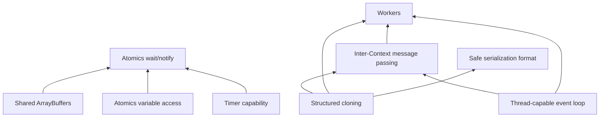

# JavaScript Threading and Workers Plan

When Rhino was first written, threads were new-ish, and Java had them. 
The threading contract for JavaScript was not as clear, so Rhino supports
a number of different ways to handle threading.

Today, JavaScript defines a memory model, and the most common use cases -- the browser
and Node.js -- explicitly support that. 

This document proposes a set of changes to allow Rhino embedders, if they wish, to
take advantage of standard JavaScript capabilities like Workers, Atomics, and message 
passing to build multithreaded systems that use Rhino in a standards-compliant way.

## Rhino Threading Invariants

Rhino supports, and must continue to support, a few basics of its threading model:

### Basics

In Rhino, a script consists of the following:

1) The script source itself and its associated AST and IR
2) Optional compiled bytecode representing the script
3) A top-level scope that is the root for all objects, including built-in types
4) A Context that maintains various aspects of execution state

Unless optional thread-safety features are used, the following rules must
be followed:

1) The script, once either rendered to an AST or optionally compiled, should be considered immutable and may be shread by many threads.
2) The top-level scope is not thread safe in any way and must be used by a single thread at a time
3) Each Context is bound to a specific thread and may not be used by another thread
4) A single JVM may contain any number of top-level scopes and contexts executing in different threads concurrently

### Single-threaded Context

The rhino Context object is the basis of the runtime engine of Rhino. It is used in
almost every internal call to maintain state. Context objects, since the beginning 
of this project, have been stored in a thread-specific data slot and are restricted
to use by a single thread at a time.

### Single-threaded objects

JavaScript objects in Rhino, including the top-level "global" object where the built-
in types are defined, are single-threaded by default. There is no guarantee of any kind
of correctness if they are shared between threads.

### Multi-threaded primitives

Any aspects of Rhino that are shared between Contexts and top-level scopes, such as 
caches, must be thread-safe so that many scripts can execute at the same time.

A picture of the current model:

```
    Thread A                 Thread B                Thread C
       |                        |                       |
       v                        v                       v
  +------------+          +------------+           +------------+
  |  Context A |          |  Context B |           |  Context C |
  | bound to   |          | bound to   |           | bound to   |
  | this thread|          | this thread|           | this thread|
  +-----+------+          +-----+------+           +-----+------+
        |                        |                       |
        v                        v                       v
  +------------+          +------------+           +------------+
  | top-level  |          | top-level  |           | top-level  |
  | scope A    |          | scope B    |           | scope C    |
  | (NOT       |          | (NOT       |           | (NOT       |
  | thread-    |          | thread-    |           | thread-    |
  | safe)      |          | safe)      |           | safe)      |
  +------------+          +------------+           +------------+

  ------------------- shared by all threads ----------------------
  * script source, AST, IR, and compiled bytecode (immutable)
  * global caches and other static state (must be thread-safe)
```

### Optional features

Rhino includes a few optional features that change some of these invariants, which
are described in the appendix.

## Missing Features

This threading model maps well to the JavaScript memory model. In this model, multiple
scripts may execute in different threads in parallel, and there are only a few very
specific ways in which different threads may share data -- namely, shared array buffers,
the Atomics object, and message passing via the Workers API (which is technically part of
WHATWG and not ECMAScript).

The rest of this document describes what it would look like to implement the following
capabilities in Rhino. They are listed in reverse order of "what depends on what":

* Structured cloning
* Thread-capable event loop
* Inter-Context message passing 
* Workers (depends on structured cloning and an event loop)
* Shared ArrayBuffers
* Atomics class variable access and modifications
* Timer capability
* Lock support from Atomics object (depends on shared ArrayBuffers)
* Safe serialization format (depends on structured cloning)



### Structured Cloning

This WHATWG specification describes a way to safely make clones of a tree of JavaScript
objects so they may be transferred to another script. It lays out how to handle the 
numerous edge cases that make up the majority of JavaScript such as native objects,
custom properties, prototypes, and the like. Implementing this in Rhino is straightforward.

### Thread-Capable Event Loop

Rhino originally had no concept of an "event loop" -- it just runs a script or calls
a Function and that's the end of it. With the advent of Promises we added a non-thread-safe
event queue tied to the Context object, and we drain this queue at the end of every
script and top-level function.

Other capabilities of all this will require a way to post events to run in a Context
in a different thread. It will require a program that embeds Rhino to be able to
pause while waiting for new messages, and also to decide when to pause.

It would not be appropriate for us to add this to the existing "microtask" queue
since that queue is not thread-safe and making it so would slow down non-threaded
applications. 

It makes sense, then, to create a top-level event queue abstraction so that Rhino
embedders can control when events are processed and include their own callbacks,
such as for network I/O.

However, the "asyncWait" functionality of the Atomics object depends on a rudimentary
timeout capability, which implies some more sophistication to the built-in Rhino
event loop, since scripts might use this that don't need an event loop. (Interestingly,
this is the only feature in ECMAScript that needs this.)

Whatever we do, we will retrofit the Rhino shell to use the new event loop, since it
already contains a simple timer capability via the setTimeout capability.

Some design considerations to work through:

* The new queue should be a separate, thread-safe "macro task" queue, distinct
  from the existing microtask queue on the Context (see
  `Context.enqueueMicrotask`/`processMicrotasks`). Microtasks stay fast and
  non-thread-safe; events posted from other threads go on the new queue. As in
  the HTML event loop, the microtask queue should be drained to completion
  after each posted task runs.
* The abstraction should be owned by the embedder: something like an
  EventLoop object associated with a top-level scope, with a thread-safe
  `post()` method, a `pump()`/`runPending()` method for the owning thread to
  call, and optional hooks so the embedder can interleave its own work
  (network I/O callbacks, etc.).
* The shell's current Timers class (rhino-tools) blocks its thread sleeping
  until the next timeout fires. Retrofitting it to the new event loop means
  replacing that sleep-and-poll loop with a timed pump.
* Atomics.waitAsync needs timeout delivery even for scripts that never touch
  the rest of the event loop. That argues for a minimal built-in default
  (for example, a single shared timer thread that posts expirations onto the
  context's queue) rather than making the full event loop mandatory.
* If a context has an event loop installed, blocking Atomics.wait is probably
  the wrong primitive anyway -- see the "No-Park Mode" open issue below.

### Workers

The Worker API is a WHATWG (but not ECMASCript) standard that is implemented in 
browsers and in Node.js. It is not necessary for Rhino to implement all of it,
but the basic "Worker" API to launch a script in a new thread, and the postMessage
capability to send cloned objects between workers are the useful parts.

We will implement this API in a straigtforward way, building on the event loop
and structured cloning features. It should be a separate module since it is not
technically part of ECMAScript.

### Shared ArrayBuffers

Structured cloning will give us a way to send copies of buffers between scripts in
different threads via message passing. Shared array buffers give the threads a way
to share memory, with the equivalent of Java's "Atomic" family of primitive types,
a "volatile" equivalent, and a rudimentary locking capability.

As part of this we will do two other things:

First, we will modify the existing ArrayBuffer to use a ByteBuffer rather than a 
plain byte[] array. That will be necessary to support direct (off-heap) buffers.

Second, shared array buffers must be allocated as direct ByteBuffers. This is
not merely a performance choice: on JDK 22 and later, the VarHandle volatile
and atomic operations that implement Atomics only work on direct buffers (see
the "Direct Buffers" open issue below for details). The current working
branch already allocates shared buffers this way in
`NativeArrayBuffer.allocateBuffer()`. We may also want to consider whether
other non-shared buffers, such as buffers larger than a particular size, be
made direct buffers as well so that we can reduce heap pressure.

In order for shared arraybuffers to support the Java memory model, even
non-Atomics based changes to the buffer via the DataView class on numeric
types should be "tear free." That requires moving to VarHandle for those
operations rather than doing it in a bitwise way. This has been researched and
confirmed: VarHandle accesses on a ByteBuffer (via
`MethodHandles.byteBufferViewVarHandle`) compile down to single machine-word
loads and stores for 4- and 8-byte values, so even plain (non-volatile)
get/set are tear-free; 1- and 2-byte values are inherently tear-free because
they are sub-word. Two caveats: volatile and atomic VarHandle operations
require the position to be naturally aligned (typed arrays are always aligned,
but DataView permits arbitrary byte offsets -- DataView uses plain get/set, so
this is not a problem today), and plain accesses provide no happens-before
edge, so another thread may observe a stale value for an unspecified time.
That matches the ECMAScript spec, which treats non-atomic accesses to shared
memory as unordered. The current working branch already routes all DataView
and typed-array numeric accesses through these VarHandles.

### Atomics Class (minus locking)

With shared array buffers in place (or even without) we can implement the various
methods of Atomics like "get," "set," "add," "compareExchange," and so on. The
best way to implement these in Java is to use the VarHandle type, which will allow
"tear-free" operations in all cases, and support the right memory semantics for
*some* data types.

For data types where VarHandle is incapable of atomic operations, we will have
to use good old-fashioned synchronization. This will certainly be necesary for
the UInt8 types, for example.

VarHandle is supported on more recent Android API versions -- see below.

### Timer Capability

The "waitAsync" capability of Atomics allows a thread to wait for a "notify"
to be called by returning a Promise that will be fulfilled only when the
lock is notified. This has an optional timeout, which means that we need a way
to deliver a result to a Promise after some time.

We can do this in one of two ways:

1) Spawn a separate timer service in another thread (possibly shared) that will use the inter-thread message-posting mechanism built above to deliver the notification
2) Embed a timer queue or wheel with the event loop mechanism and implement the timer within the same thread

The problem with the second mechanism is that not all Rhino embedders will use the
full event loop. There must be a way to make this work in a default WHATWG-free Rhino
environment with an optional customization capability.

### Atomics Locking Capability

With the shared buffers, atomics, and timers in place, we can implement the
"wait" and "notify" capabilities of the Atomics object without much new complication!

Status: a first implementation of wait/notify already exists on the current
working branch (a `Waiters` class using `LockSupport.parkNanos`, wired up for
Int32Array). It still needs the timer/event-loop work above to finish
waitAsync, and it has a known spec gap: the value must be re-checked after a
wake-up so that a value which changed during the wait reports "not-equal"
rather than "ok".

### Serialization Format

V8 builds on structured cloning to define a simple object serialization component that
works around the complexities and security holes of Java serialization by making it possible
to safely serialize objects that make sense to send between processes.

It would be a mistake to try and promise compatibility with V8, since its format is 
part of the implementation and not a formal spec, but we can use a very similar format.
This would provide an alternative to Java serialization which gives users a way to move
away from it and would let us even disable serialization by default.

# Open Issues

## Direct Buffers

Do we *need* direct buffers for shared ArrayBuffers to work? Yes -- if we want
portable lock-free Atomics. This was researched empirically (Temurin 17, 21,
and 24, and OpenJDK 25) and traced to the JDK source:

* Plain get/set VarHandle operations on a ByteBuffer work on both heap and
  direct buffers on every version tested, and tolerate unaligned positions.
* Volatile operations (`getVolatile`, `setVolatile`) and all atomic
  read-modify-write operations (`compareAndExchange`, `getAndAdd`,
  `getAndBitwise*`, `getAndSet`) work on both heap and direct buffers on JDK
  9 through 21. Starting with JDK 22, they throw `IllegalStateException`
  ("Atomic access not supported for heap buffer") when the ByteBuffer is
  heap-backed. The change came from JDK-8318966 (commit 9c852df6aa, merged
  Feb 2024), which reworked the generated ByteBuffer-view VarHandles to route
  memory accesses through the FFM-era `ScopedMemoryAccess` machinery, which
  only implements atomic operations for direct buffers.
* Atomic RMW operations exist only for int and long. short supports volatile
  access but no `compareAndExchange` or `getAndAdd`, and byte is not supported
  by `MethodHandles.byteBufferViewVarHandle` at all. (This matches the current
  implementation, which falls back to synchronized blocks for 8- and 16-bit
  typed arrays.)
* Volatile and atomic operations also require natural alignment; unaligned
  positions throw `IllegalStateException` ("Misaligned access at index: ...").

So the decision tree is simple: if shared ArrayBuffers ever expose Atomics
(with or without locking), they must be direct ByteBuffers, and the current
working branch already does this. On JDK 17 (Rhino's build baseline) the
atomic operations would happen to work on heap buffers too, but relying on
that would break at runtime on JDK 22 and later, so direct is the only
portable choice. Plain (non-shared) ArrayBuffers can remain heap-backed,
since nothing requires atomicity there.

A corollary for the implementation: the spec hands a non-shared ArrayBuffer
to exactly one agent at a time (ownership moves only via atomic transfer),
so its Atomics operations never contend with another thread. They should be
implemented with plain (non-volatile) VarHandle get/set -- and plain
read-modify-write for add/exchange/compareExchange -- rather than the
volatile and atomic variants, which throw on heap buffers on JDK 22+. Under
exclusive ownership, plain accesses are observably identical to atomic ones:
no other thread can interleave the read-modify-write, and there is no
cross-thread visibility to establish. (Engines such as V8 instead emit real
CPU atomics unconditionally, which is harmless on a single-owner buffer; the
Java VarHandle restriction makes the branch necessary here.) Note that all
Atomics operations except wait/waitAsync are spec-legal on non-shared
buffers, and Atomics.notify is defined to return 0 on them -- matching what
Node.js does.

The old performance argument against direct buffers (extra mapping/pinning
overhead on every access) no longer holds on modern HotSpot for simple element
accesses; the `ByteBufferBenchmark` added to the benchmarks module can
quantify the current difference if needed. The real trade-offs now are:

* Direct memory lives outside the Java heap and is reclaimed by a Cleaner, so
  it is freed only when the garbage collector runs. Many large direct buffers
  can exhaust native memory without triggering a Java OutOfMemoryError
  (bounded by `-XX:MaxDirectMemorySize`, which defaults to the heap size).
* Direct buffers have no backing array (`buffer.hasArray()` is false), so the
  deprecated `NativeArrayBuffer.getBuffer()` returns null for them. Callers
  must move to the ByteBuffer API.

Sticking with byte[] as the backing store is only viable if we give up
lock-free Atomics entirely (every cross-thread access becomes a synchronized
block on one monitor per buffer). Not recommended.

## Endianness

Like the rest of Java, Rhino ByteBuffers default to big-endian mode. JavaScript
ArrayBuffers actually default to little-endian mode. (And that is faster, even 
in Java, on the vast majority of today's hardware now that people don't run on
Sun SPARC any more.) It is possible that existing JavaScript code may break in
Rhino if it assumes little-endian access. 

Research on the implications of flipping the default to little-endian:

* Per the ECMAScript spec, typed array element accesses are always
  little-endian, while DataView getters and setters default to big-endian
  unless passed an explicit littleEndian flag.
* Rhino today splits the difference: DataView honors the littleEndian flag
  and defaults to big-endian (spec-compliant), but typed array element
  accesses follow the ByteOrder of the underlying buffer, which defaults to
  big-endian unless `Context.FEATURE_LITTLE_ENDIAN` is enabled. In other
  words, Rhino's typed arrays are non-spec-compliant by default.
* Flipping the default makes typed arrays spec-compliant and does not change
  DataView behavior at all. Little-endian is also the native order on x86 and
  ARM, so it avoids byte-swapping on the vast majority of hardware.
* What could break: JavaScript written against Rhino's historical big-endian
  typed-array layout (for example, code that packs network packets into an
  Int32Array expecting big-endian bytes on the wire), and Java code that reads
  the raw backing bytes assuming big-endian. Both are rare in practice, but
  they are silent behavioral changes, not errors.

Recommendation: flip the default in 2.0, which is the breaking-change window
anyway. Keep FEATURE_LITTLE_ENDIAN as a no-op for compatibility (or repurpose
it as a big-endian override for legacy interop), and call the change out
prominently in the release notes.

## Android

VarHandle is only available in Android API version 33 (Tiramisu, 2022) and up.
Can we require that? Otherwise we need a more complicated implementation.

Research: the repository's Android integration tests (it-android) currently
target minSdk 26 with compileSdk 33, so requiring API 33 would drop support
for Android 8 through 12, which still represent a substantial installed base.
Options:

1. Require API 33. Simplest; matches the compileSdk the tests already use.
2. Runtime detection: use the VarHandle path on API 33+ and fall back to
   synchronized-block implementations below it. The fallback is functionally
   complete (the 8- and 16-bit types already use synchronization, and the
   int/long types can as well), just contended under parallel access.
3. Ship two code paths selected at class-load time, keeping the hot path free
   of per-operation feature checks.

Note that the Foreign Function & Memory API (see "MemorySegment" below) is not
available on Android at all, so any future FFM-based path would need the same
fallback regardless. Recommendation: option 2 if the community cares about
pre-33 devices; otherwise option 1.

## No-Park Mode

Browsers often support a mode in which Atomics.wait will throw an exception instead
of blocking the thread. Rhino embedders will also appreciate this! The question is,
should a blocking wait be allowed or disallowed by default?

Research: in browsers, Atomics.wait throws a RangeError when called on the main
thread and is only permitted inside Web Workers, where blocking is safe because
the worker has no other work to do. Node.js behaves the same way: Atomics.wait
throws ERR_ATOMICS_WAIT_NOT_ALLOWED on the main thread but works in
worker_threads. The rationale in both cases is that the main thread must remain
responsive to input and rendering.

Rhino has no concept of a "main thread"; a Context simply runs on whatever
thread the embedder gives it, so Rhino cannot make the browser's distinction on
its own. A blocking Atomics.wait will block that thread, full stop -- which is
catastrophic for a server embedder that evaluates scripts on request-handler
threads, and harmless for an embedder that dedicates a thread to a script.

Recommendation: allow blocking waits by default (Rhino is an embedded engine
and the embedder owns its threading), but provide opt-outs:

* A Context-level feature flag that makes Atomics.wait throw, mirroring the
  browser main-thread behavior for embedders that want it.
* When a context has an event loop installed (see above), prefer returning a
  Promise (waitAsync semantics) over blocking, since a pumping thread cannot
  usefully block anyway.

## MemorySegment

The Java MemorySegment API may be an alternative to ByteBuffer for allocating buffers.
It's not clear whether it's a replacement or a complement.

This API is the only way in Java to implement the specified semantics of variable-length
array buffers and growable shared array buffers, which require that memory be
"reserved" but not "allocated." ByteBuffers do both, which could cause scripts
that depend on the specified behavior to throw OOM errors.

This would complicate Android support and would need a backup plan.

Research (verified against the JEP texts, the JDK 16-25 source trees, and
small test programs):

* The premise that MemorySegment is "the only way" to reserve without
  allocating does not hold. No released version of the API -- incubator
  (JDK 16-18), preview (JDK 19-21), or final (JDK 22+) -- has ever offered a
  reserve-without-commit operation. `Arena` (which replaced `MemorySession`
  in the JDK 20 preview) offers only `allocate(size, alignment)`, which
  commits immediately.
* FFM also does not solve the small-type atomics problem. MemorySegment has no
  direct atomic methods; atomics are obtained from `ValueLayout.varHandle()`.
  Empirically, those handles support full volatile/atomic operations for int
  and long, volatile only for short, and nothing beyond plain get/set for
  byte -- the same gaps as the ByteBuffer VarHandles, so 8- and 16-bit typed
  arrays would still need synchronized fallbacks.
* Where FFM genuinely helps: buffers larger than 2 GB (ByteBuffer sizing is
  limited by int), deterministic off-heap deallocation when an Arena is closed
  (instead of waiting for the GC's Cleaner), zero-copy bridging with existing
  ByteBuffers (`MemorySegment.ofBuffer` / `asByteBuffer`), and structured
  access via layouts.
* On growable buffers specifically: native allocations (mmap) reserve virtual
  address space and commit physical pages lazily on first touch. So
  allocating maxByteLength up front costs virtual address space, not RAM, and
  the feared OOMs from "reserving" a large growable buffer are largely a
  non-issue on 64-bit systems. The current realloc-and-copy growth strategy
  works too, at the cost of transiently needing twice the memory.
* Costs: FFM requires Java 22+, is not available on Android at all, and adds
  arena lifetime management (confined arenas are single-threaded, so shared
  buffers would need shared arenas) on top of everything else.

Conclusion: a complement, not a replacement. Defer adoption until a concrete
need appears (multi-gigabyte buffers or deterministic off-heap cleanup); keep
ByteBuffer as the storage mechanism for now.

## Relaxing other Restrictions

Passing messages between scripts in many JavaScript environments seems to sometimes
require not only cloning objects, but serializing and deserializing them. (This is
what Node seems to do.) In Java, we can run many different scripts in different threads
safely in the same JVM with the same garbage collector, so we can pass cloned
objects between threads by just changing the prototype and parent scope objects.

Not all of the restrictions regarding locking with Atomics need hold in Java. 
The lock support in Atomics is designed for a world in which each lock is actually
a pointer to a "futex" structure in V8, and the lock support is all designed around
those limitations. For example, this is why locking only works with a shared array buffer.
We will not have the same restrictions in Java and might want to consider that.

Perhaps we could consider additional locking support that is more efficient because it
uses capabilties built in to Java, but that may not be worth the effort.

Research notes:

* On cloning vs. serializing: V8/Node serialize postMessage payloads because
  their isolates and processes do not share a heap. Inside one JVM all contexts
  share a garbage collector, so passing cloned objects directly (as this plan
  proposes) is strictly cheaper and loses nothing -- structured cloning remains
  the semantic boundary (it decides what is transferable and resets prototypes
  and scopes), while binary serialization is skipped.
* V8's serialization format is confirmed to be an implementation detail, not a
  specification; no compatibility promise is possible or advisable.
* On relaxing Atomics wait/notify to non-shared buffers: the spec mandates a
  TypeError for wait/notify on non-shared buffers, and test262 enforces it.
  Offering it by default would break conformance. If we offer it at all, it
  should be an explicitly non-standard extension behind a feature flag. Given
  that Synchronizer (see appendix) and ordinary Java locks are available to
  embedders who want richer locking, the effort is probably not worth it.

# Additional Data

## Appendix: Existing Rhino Threading Support

Research into what Rhino already provides:

### Context-to-thread binding

* Each Context is bound to exactly one thread via a ThreadLocal
  (`Context.currentContext`). `Context.enter()`/`exit()` manage the
  association, and `ContextFactory.call(ContextAction)` runs a unit of work
  with a context associated for the duration. Using a Context from another
  thread throws IllegalStateException.
* `Context.putThreadLocal`/`getThreadLocal`/`removeThreadLocal` provide
  per-context, per-thread scratch storage.

### Thread-safe objects (optional)

* `Context.FEATURE_THREAD_SAFE_OBJECTS` (default false; can be forced on via
  the `rhino.useThreadSafeObjectsByDefault` system property) causes every
  ScriptableObject to use a StampedLock-based property map
  (`ThreadSafeHashSlotMap`) instead of the plain `HashSlotMap`. The
  `LockAwareSlotMap` interface exposes the read/write stamps, and compound
  operations run under a single stamp via `ThreadSafeCompoundOperationMap`.
* Important limitation: this protects only the property maps. It does not make
  object behavior (methods, internal state of specific builtins) thread-safe.
  See `ThreadSafeScriptableObjectTest` and `DeadlockReproTest` for current
  coverage and known deadlock scenarios.

### Synchronizer / sync()

* The "Rhino-specific locking class" is `org.mozilla.javascript.Synchronizer`.
  It wraps a JavaScript function so that each invocation runs while holding a
  Java monitor on the `this` object (or an explicitly supplied lock object).
  The shell exposes it as the global `sync(fun)` helper. This is the
  documented escape hatch for sharing objects between threads today.

### Shell timers

* rhino-tools ships a `Timers` class implementing setTimeout/clearTimeout for
  the shell. It is single-threaded: a priority queue of timeouts plus
  `Thread.sleep` on the shell's own thread, driven by `Main`. This is the
  functionality that will be retrofitted onto the new event loop.

### Multi-threaded primitives

* Anything shared across contexts -- the global ContextFactory, generated
  classes once compiled, error message tables, service-loaded components such
  as the RegExpLoader -- must be thread-safe, and is. Compiled scripts and
  their ASTs/IR are treated as immutable and freely shared.

### In-progress (current working branch)

* The greg-all-atomics branch already contains: `NativeAtomics` with
  load/store/add/sub/and/or/xor/exchange/compareExchange/pause/wait/waitAsync/
  notify/isLockFree; `AtomicSupport` and `WaitSupport` interfaces on the typed
  arrays; VarHandle-based element access for all numeric types;
  SharedArrayBuffer backed by direct ByteBuffers; and a `Waiters` class
  implementing wait/notify with `LockSupport.parkNanos` (currently wired up
  for Int32Array only). Known gaps: waitAsync is unimplemented, and
  `Waiters.waitSync` does not re-check the value after being woken by a
  notification, which the spec requires in order to return "not-equal" when
  the value changed during the wait.